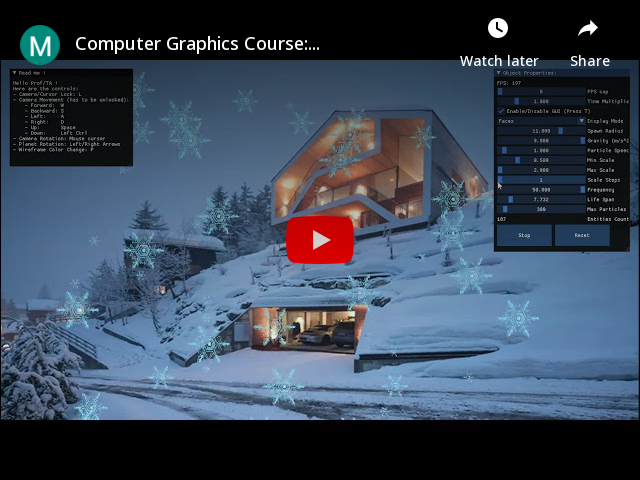

# Assignment 2 of Fundamentals of Computer Graphics: Planets Rotation

    

# Introduction

For this assignment, the main theme was `Planets Rotation`.

The objectives here were:

1. Set the orbits, size and textures of the planets
2. Add keyboard control to increase/decrease the rotation speed
3. Add fonts. Each planet moves with its name

# Compilation

This project and all of my CG projects will be compiled with CMake, if you open the project directly with Visual Studio, you should be able to directly compile it.
Though, as CMake permits it, you will be easily able to compile on other platforms.

# Demonstration

## Content

For my Assignment, I got all these points covered:

- Textured planets
- Font change
- Rotation Speed Control
- Bonus:
    - Camera Movement + Rotation (can be enabled/disabled)
    - Simple Lighting (with the Sun being a PointLight)
    - Focus View System
    - Display Mode (Vertices, Wireframe, Faces)
    - Luminosity parameters Control
    - Enable/Disable GUI

## How to use it

You can launch the `Assignment2.exe`directly, if you already have Visual C++ Redistribuable.

The program was compiled in Release mode.

As it is displayed in the program, here are the controls by order of priority for the assignment:

## Controls

- Change Font: F
- Enable/Disable GUI: T
- Change Rotation Speed: ⬅️➡️
- Object View Mode Switch: C
- Wireframe Color Change: P
- Camera/Cursor Lock: L
- Camera Movement:
    - Forward: W (or Z on AZERTY layout)
    - Backward: S
    - Left: A (or Q on AZERTY layout)
    - Right: D
    - Up: Space
    - Down: Left CTRL

## Additional Interactions

- You can change the `Title color`
- You can change the `Planets Rotation speed` with a slider
- You can change every parameters related to the sun’s emitted light
- You can change the Display Mode on the `Display Mode`menu.
- You can select a Planet to focus and that will lock your camera on, though you can move and the camera will only rotate towards the focused planet.
- You can click on the `Activate the Funny`button to replace every planet with a giant rat

# Code Architecture

The Complete Documentation is available in the project, in the Code Architecture part will only be explained a small description of what classes do.

## Documentation

There is a documentation available [here](https://kevinpruvost.github.io/ComputerGraphics_Assignment2/) or in `docs/index.html` if you want to have a better view on the classes I made.

# Important Points/Personal Reminders

- Uniform Buffer Object tend to be very useful within contexts where uniform variables do not change through every loop. We can just send these variables to Uniform Buffer Objects to make less calls to the GPU.
- Getting Uniform Locations is a very heavy process, it is better to store the return values CPU side to limit GPU calls.

